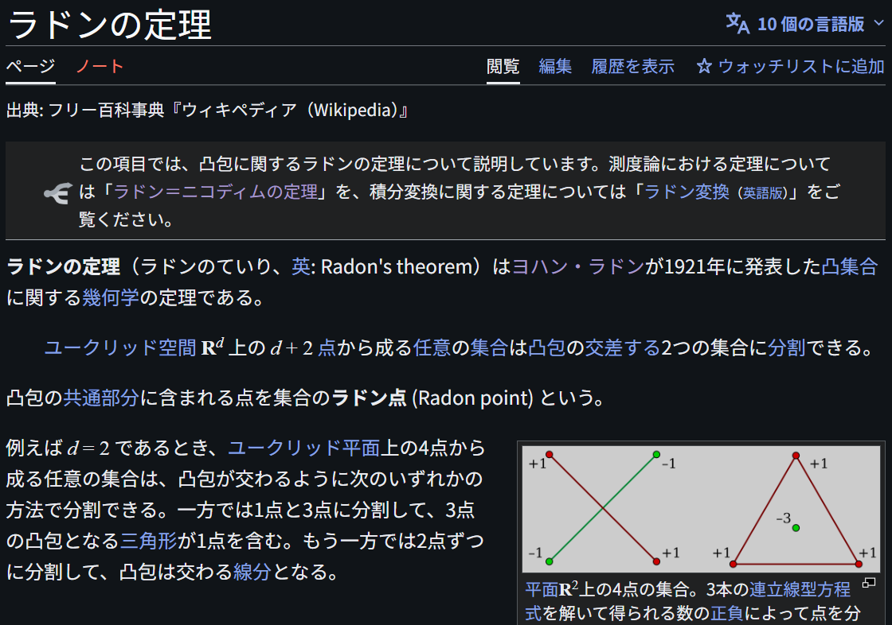
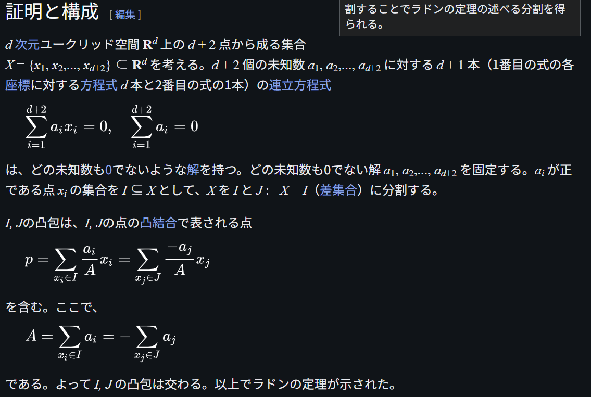

# Radon's Theorem

文献:

https://ja.wikipedia.org/wiki/%E3%83%A9%E3%83%89%E3%83%B3%E3%81%AE%E5%AE%9A%E7%90%86

解説:

Radon--Nikodym Derivativeで知られる[Radon](https://ja.wikipedia.org/wiki/%E3%83%A8%E3%83%8F%E3%83%B3%E3%83%BB%E3%83%A9%E3%83%89%E3%83%B3)さんの見つけた定理。
凸集合に関する基本的な性質の一つ。
