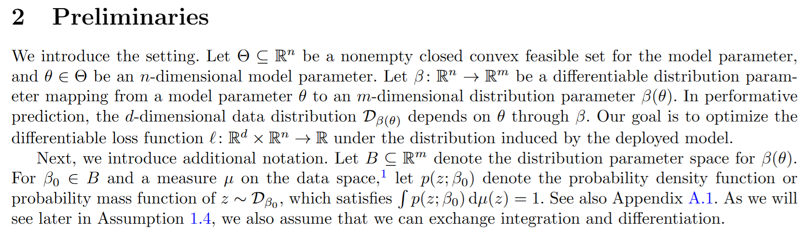
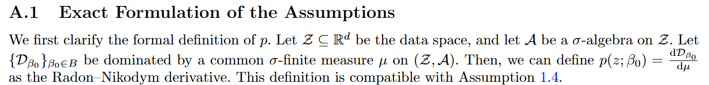
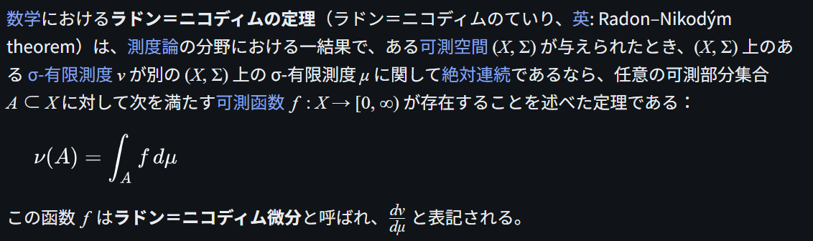

# Radon--Nikodym Derivative

文献:

https://arxiv.org/abs/2607.26562

(我々の論文)

https://ja.wikipedia.org/wiki/%E3%83%A9%E3%83%89%E3%83%B3%EF%BC%9D%E3%83%8B%E3%82%B3%E3%83%87%E3%82%A3%E3%83%A0%E3%81%AE%E5%AE%9A%E7%90%86

解説:

以下の解説が具体例を用いた説明をしており、非常に参考になる(通常のサイコロを振る際の確率測度 $P$ と、456賽を振る際の確率測度 $Q$ の関係を考えている)。

https://peng225.hatenablog.com/entry/2025/04/04/124548

ただし、少なくとも最適化の文脈でRadon--Nikodym derivativeを用いる際、確率密度関数や確率質量関数を定義することが多いと思っているので、その点はやや注意が必要。離散分布の場合、確率変数 $X$ の分布を $P_X$ とし、状態空間上の数え上げ測度（counting measure）を $\\\#$ とすると、$p_X(x)=\frac{\mathrm{d}P_X}{\mathrm{d}\\\#}(x)$ と定義できる。連続分布の場合は、数え上げ測度がLebesgue測度に置き換わる。

この間とある飲み会に行って、機械学習系の会議に出した最適化の論文(上記)で、Radon--Nikodym derivativeを持ち出したという話を友人にしたら、査読者が困っちゃうよと言われました。現に私があんまり分からなくなっているので、そうかも知れません。
