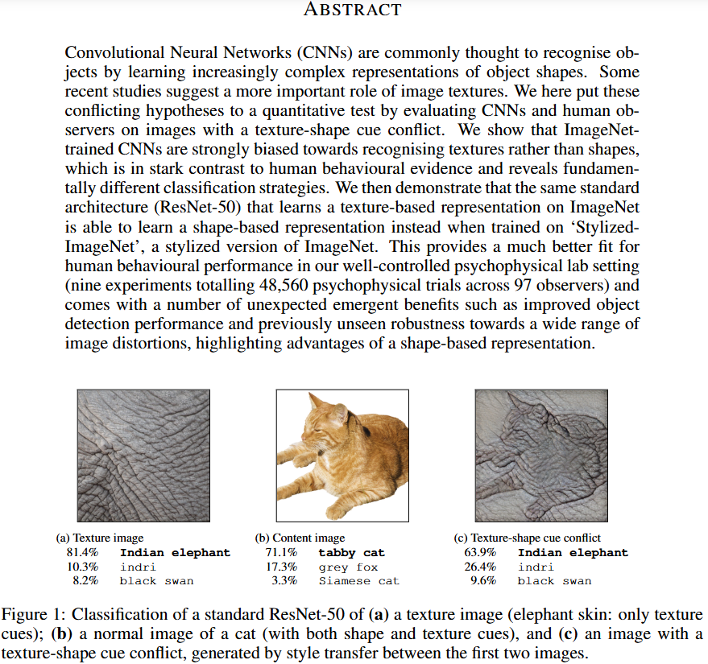
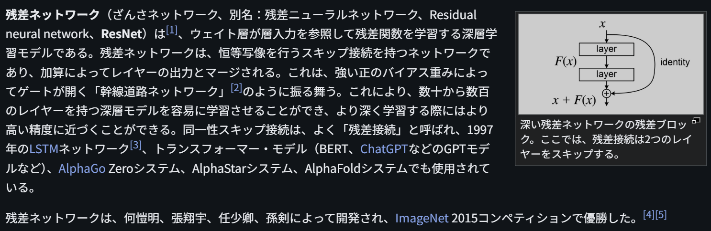

# ResNet

文献:

https://arxiv.org/pdf/1811.12231

https://ja.wikipedia.org/wiki/%E6%AE%8B%E5%B7%AE%E3%83%8D%E3%83%83%E3%83%88%E3%83%AF%E3%83%BC%E3%82%AF

解説:

現代では古典的手法なのかも知れない。
2018年には、ImageNetで学習したCNN（ResNet-50を含む）が、大域的な形状よりも局所的な情報(texture)に引っ張られやすい傾向が指摘されている。
