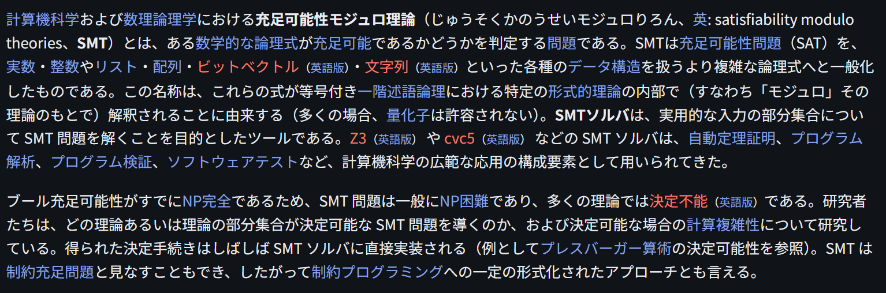

# Satisfiability Modulo Theories

文献:

https://ja.wikipedia.org/wiki/%E5%85%85%E8%B6%B3%E5%8F%AF%E8%83%BD%E6%80%A7%E3%83%A2%E3%82%B8%E3%83%A5%E3%83%AD%E7%90%86%E8%AB%96

解説:

Moduloというのがややこしいが、剰余の意味ではなく、理論を考慮した充足可能性判定くらいの意味か。
真偽のみを扱うSATに比べて、整数や実数なども扱えるSMTは表現能力が高い。
Leanなどの定理証明支援系と比べると、表現能力は劣るが、探索能力は高い。
