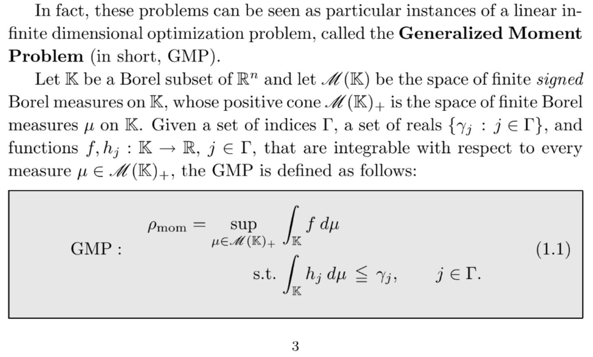

# Generalized Moment Problem

文献:

https://arxiv.org/abs/2608.24184 (この文献の[9]が下にあたる)

https://books.google.co.jp/books?id=lFi7CgAAQBAJ

解説:

未知の測度を変数とし、その[モーメント](https://ja.wikipedia.org/wiki/%E3%83%A2%E3%83%BC%E3%83%A1%E3%83%B3%E3%83%88_(%E6%95%B0%E5%AD%A6))に関する線形制約の下で測度の線形汎関数を最適化する無限次元線形計画問題である。
データが多項式の場合は[the moment Sum-of-squares (SOS) hierarchy](https://arxiv.org/abs/2608.24184)による半正定値計画緩和で近似できる。
