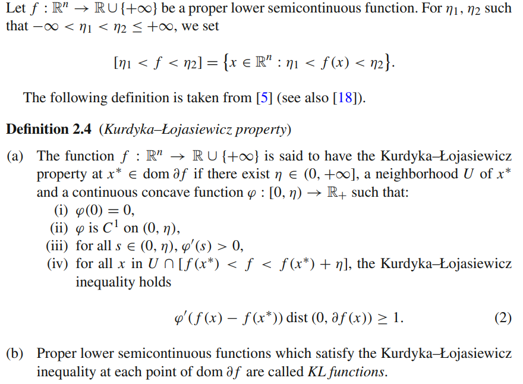

# KL property

文献:

https://doi.org/10.1007/s10107-011-0484-9

スクショ:

解説:

KL Propertyは、臨界点の近傍で関数値の差と劣勾配の大きさをもとに、目的関数が過度に平坦になることを排除する性質。
非凸非平滑な場合の収束解析などに用いられる。

なお、

- KL propertyのKL = Kurdyka–Łojasiewicz
- KL divergenceのKL = Kullback–Leibler

なので、人違いに注意。
