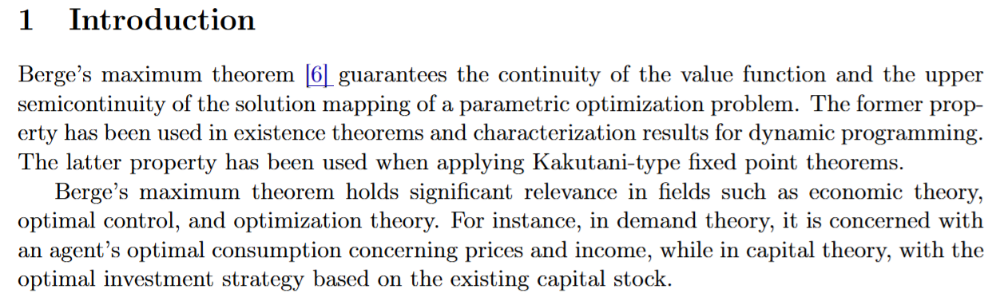

# Maximum Theorem

文献:

https://en.wikipedia.org/wiki/Maximum_theorem

(この $f^*(\theta)$ が連続というのが主張の一つ)

https://arxiv.org/abs/2608.25789

解説:

この定理は、パラメータに依存する最適化問題が、パラメータに関して連続的な解を持つための条件を提供している。
