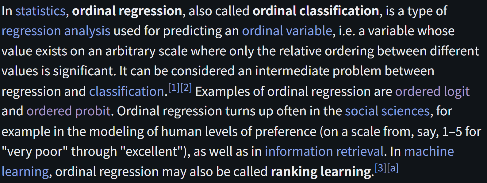
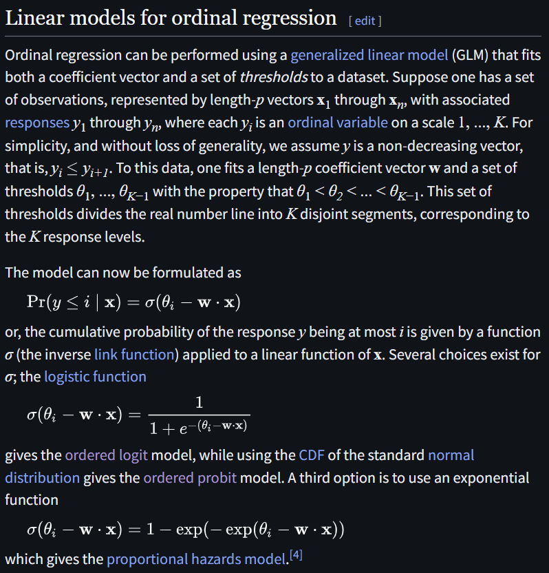

# Ordinal Regression

文献:

https://arxiv.org/abs/2608.06881

https://en.wikipedia.org/wiki/Ordinal_regression

解説:

順序回帰は順序はあるものの間隔を数量化できない目的変数と、説明変数との関係をモデル化する回帰手法である。
アンケート、疾患の重症度、信用格付けなどの予測に用いられる。
