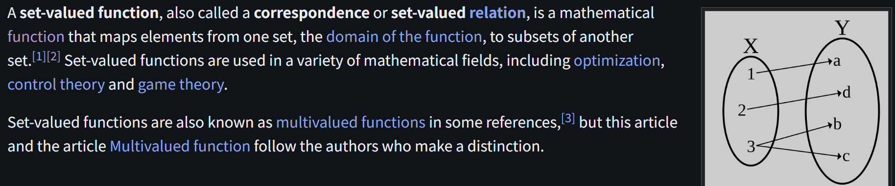
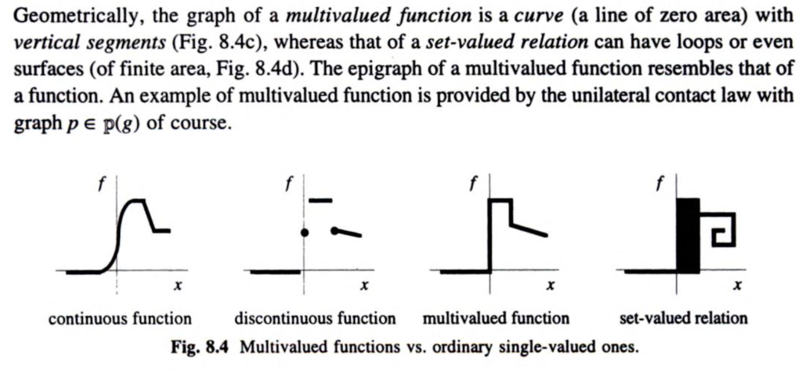

# Set-Valued Function

文献:

https://en.wikipedia.org/wiki/Set-valued_function

https://books.google.com.pa/books?id=tiBtC4GmuKcC

解説:

Set-valued functionはcorrespondenceとも呼ばれる。

また、これらの語が一体何を意図しているのかは、読んでいる文章の文脈を非常に注意深く読む必要がある。

まず、多価関数なども含めて、いわゆる関数らしきものをまとめて指せる一番広い用語は[二項関係](https://ja.wikipedia.org/wiki/%E4%BA%8C%E9%A0%85%E9%96%A2%E4%BF%82)と言える。

あくまでWikipediaの記述に従うと、二項関係のうち、

- 左全域的なだけなら広義の「対応」
- 左全域的かつ右全域的なら狭義の「対応」
- 左全域的かつ右一意的なら「関数」(「関数関係」「写像」とも)

と呼ばれているようである(ここも文献に応じて揺れがあるので、注意が必要である、対応において空集合を割り当てることを許す場合は左全域的ですらない)。

さて、ここで $X$ と $Y$ を集合とし、その間の二項関係 $f$ を考える。
もし、$x \in X$ に対して複数の $y \in Y$ が対応する場合、一見すると右一意性が失われている。
しかし、もし $x \in X$ に対して、$Y$ の部分集合 $f(x) \subseteq Y$ が対応する、と考えると、右一意性は失われていない(つまり、終域の解釈が異なる)。
よって、広義の「対応」と呼ぶべきか、「関数」と呼ぶべきかは、かなり注意深い議論が必要になる。

ここでは誤りを避けるために、これ以上の議論には踏み込まない。
