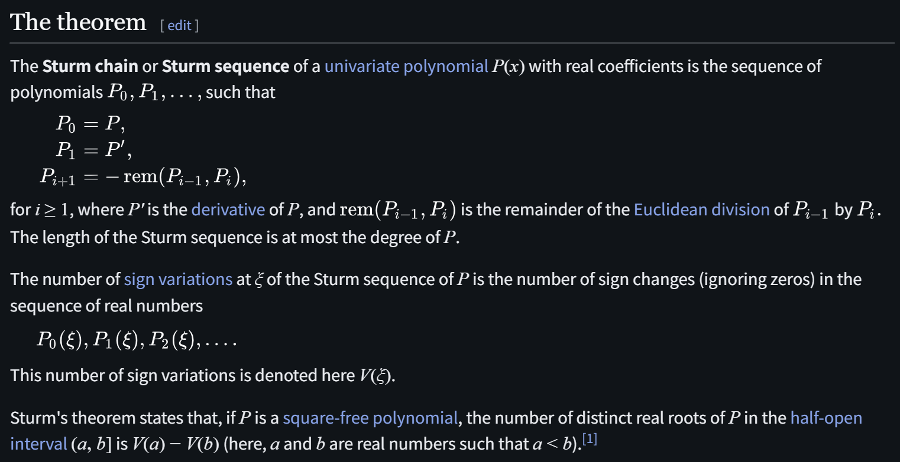
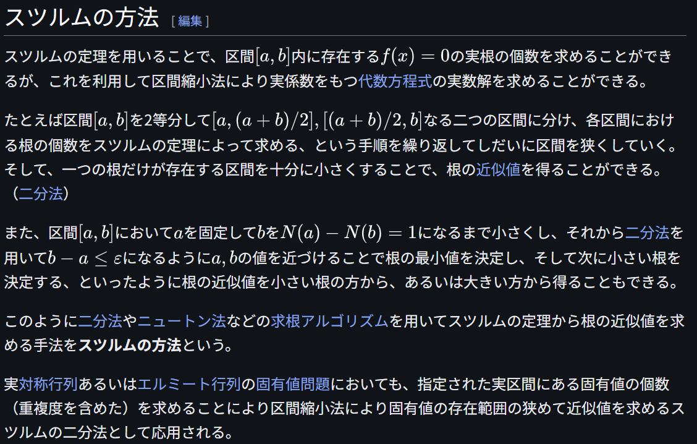
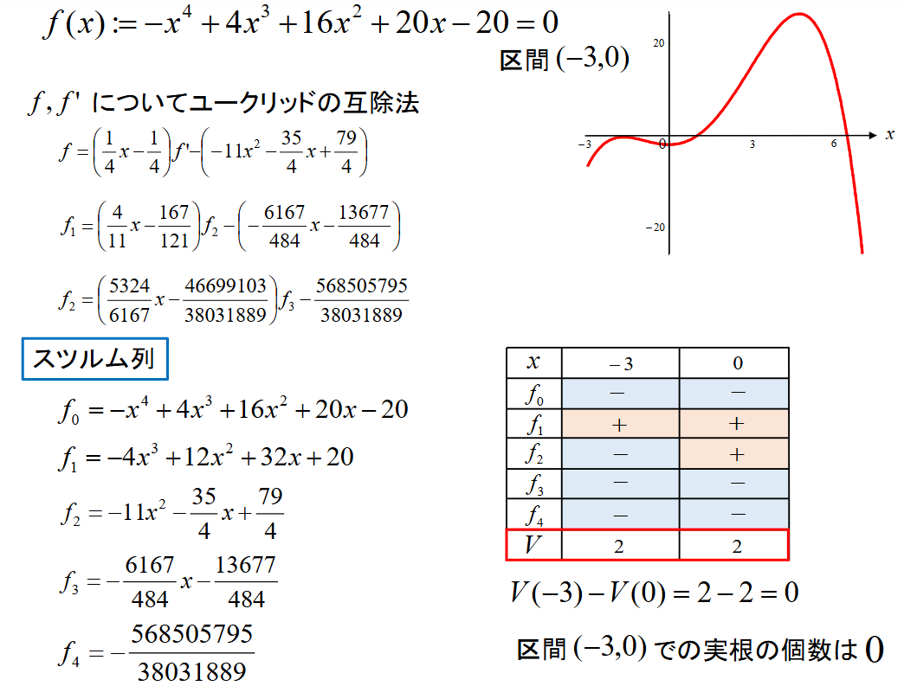

# Sturm's Theorem

文献:

https://izumi-math.jp/F_Yasuda/71_1_yasuda.pdf

https://ja.wikipedia.org/wiki/%E3%82%B9%E3%83%84%E3%83%AB%E3%83%A0%E3%81%AE%E5%AE%9A%E7%90%86

https://www.fit.ac.jp/~h-takeda/conf/files/2015/yotsutani/02.pdf

解説:

大雑把に言えば、ユークリッドの互除法を使えば、ある区間内の多項式の実根の個数を数えることが出来るというもの。
Newton法などに応用がある。

この話をしてくれた研究者は、大域最適化に関する研究をしている方だったはずですが、どのような関連があるのかは深くまで理解していません。
