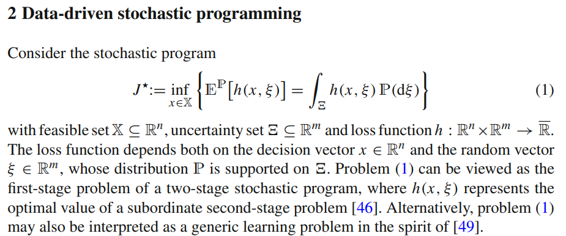
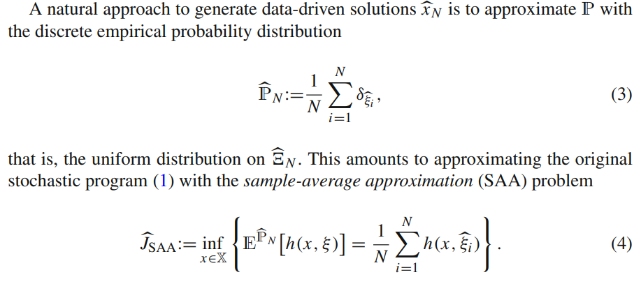
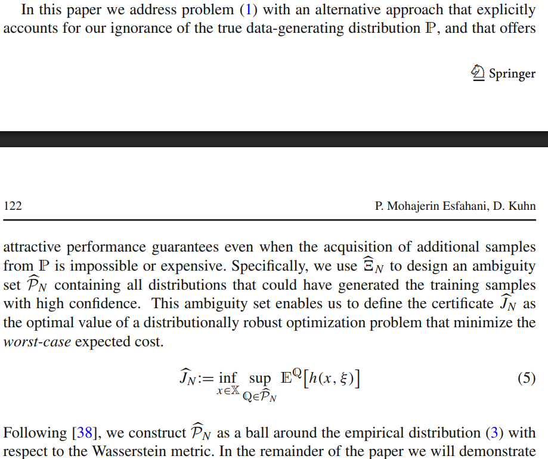
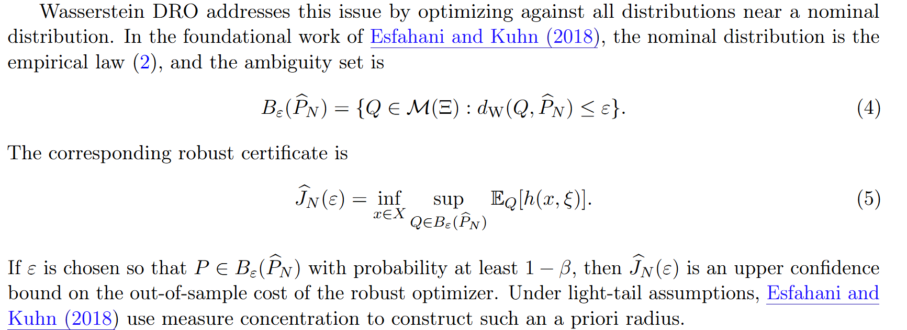

# Wasserstein DRO

文献:

https://arxiv.org/pdf/2608.18123

https://doi.org/10.1007/s10107-017-1172-1

スクショ:

解説:

Wasserstein DROは、経験分布などを中心、Wasserstein距離を半径とする分布の曖昧性集合を考え、その中の最悪分布に対して意思決定を最適化する手法。
頑健性があって偉い。
