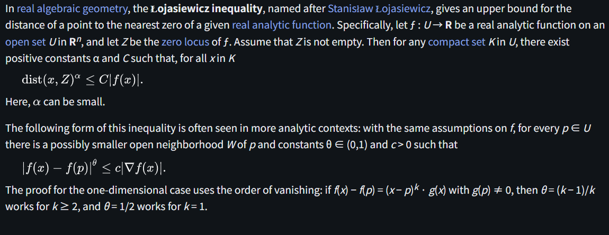

# Łojasiewicz inequality

文献:

https://en.wikipedia.org/wiki/%C5%81ojasiewicz_inequality

解説:

一見するとかなり別々の条件を同じ名前で呼んでいるように見える。
前者は零点集合からの距離と関数値の関係であり、後者は関数値と勾配の関係となっている。
式の形をざっくりと見れば、不等号、絶対値、べき乗、定数などと要素は似ているが、仮定や指数の置き方などに複数の流儀があることには注意が必要。

なお、[Stanisław Łojasiewicz](https://en.wikipedia.org/wiki/Stanis%C5%82aw_%C5%81ojasiewicz)はポーランド人で、Łは[ポーランド語](https://ja.wikipedia.org/wiki/%C5%81)のようである。

PL不等式も参照のこと。
